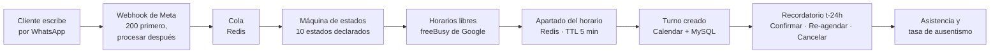

<h1 align="center">AgendaLlena</h1>

<p align="center">
  <strong>Agendamiento por WhatsApp para PyMEs latinoamericanas de 3 a 20 empleados.</strong><br>
  El cliente escribe, el bot contesta en segundos, ofrece horarios <em>realmente libres</em> del<br>
  Google Calendar del negocio, crea el turno y lo confirma 24 horas antes.
</p>

<p align="center">
  
  
  
  
  
  
  
</p>

---

## El problema

Una PyME latinoamericana de tres a veinte empleados pierde plata por dos agujeros que nadie mide:

| Agujero | Cuánto duele | Cómo lo resuelve hoy |
| :-- | :-- | :-- |
| **Tarda horas en contestar un WhatsApp** | El que pregunta por un turno y no recibe respuesta en minutos se va al siguiente | Alguien contesta cuando puede, entre cliente y cliente |
| **Entre 20% y 35% de los turnos no se presentan** | Es una silla vacía que ya estaba pagada | Nada. Nadie llama a confirmar |
| **Rechaza los CRM** | Le pidieron cambiar de herramienta y no lo va a hacer | WhatsApp y una planilla |

La tercera fila es la que define el producto: **no se le puede pedir a un dueño de PyME que cambie de herramienta.** Sigue usando su WhatsApp y su Google Calendar de siempre; AgendaLlena se mete en el medio y hace el trabajo.

---

## Qué hace, punta a punta



Todo ese recorrido funciona y está cubierto por tests. El recordatorio se envió a un celular real, se tocó **Confirmar**, y el sello volvió intacto.

Alrededor: panel Vue para el dueño (conversaciones, configuración de agenda y mensajes, asistencia, recordatorios fallidos), volcado de leads a Google Sheets, derivación a una persona, pausa del bot, y una conciliación periódica que detecta cuándo Google y la base dejaron de coincidir.

---

## Por qué lo construí

**Porque es un problema de software de verdad disfrazado de CRUD.** Un agendador parece un formulario hasta que aparecen: dos clientes eligiendo el mismo horario con segundos de diferencia, un tercero que se cae en la mitad de una transacción distribuida que no puede ser una transacción, varios negocios compartiendo la misma base sin poder verse jamás, y husos horarios que cambian por decreto y corren un turno una hora **sin lanzar un solo error**.

**Porque quería una pieza donde el criterio se vea, no se cuente.** Es fácil escribir "hago TDD" en un CV. Acá está el repositorio: cada decisión difícil tiene su porqué escrito **en el código, al lado de la línea que la implementa**, y las que todavía no se tomaron están marcadas con ⚠️ en vez de rellenadas con una suposición.

**Porque es vendible.** No es un ejercicio de portfolio: hay lean canvas, PRD, story map, 51 tickets estimados y un plan de piloto. El objetivo es facturarlo.

---

## Las decisiones que definen este código

Son las que un desarrollador senior mira para saber con qué se va a encontrar. Todas están comentadas en el archivo donde viven.

### El aislamiento entre negocios falla ruidoso

Multi-tenancy por columna `tenant_id` con Global Scope. Lo que lo hace distinto: **sin tenant activo el scope lanza una excepción en vez de no filtrar.** La alternativa habitual —no aplicar el filtro cuando no hay contexto— convierte el candado en decoración: la consulta devuelve las filas de todas las PyMEs y nadie se entera, que es literalmente la falla que el requisito existe para impedir. Un error en desarrollo es infinitamente más barato que un dato cruzado en producción.

📄 [`app/Models/Concerns/BelongsToTenant.php`](app/Models/Concerns/BelongsToTenant.php)

### Los candados viven en el esquema, no en un `if`

Un turno cancelado seguía ocupando su horario, así que el cliente que cancelaba y volvía a pedir el mismo turno recibía *"quedó reservado"* sin que existiera ni el evento en el calendario ni un turno vivo en el panel. Se corrigió con una **columna generada** que queda en `NULL` al cancelar: dos `NULL` no chocan en un índice único de MySQL, así que **la fila cancelada suelta el candado sola**. Nadie puede borrar por accidente el `if` que lo sostenía, porque no hay `if`.

Lo mismo con el candado contra recordatorios duplicados (restricción de base) y con el apartado del horario (operación atómica de Redis). **Comprobar primero y escribir después deja abierta exactamente la ventana que estos mecanismos vienen a cerrar.**

📄 [`database/migrations/`](database/migrations) · `2026_08_21_100000_make_bookings_event_unique_only_for_live_bookings.php`

### UTC se garantiza en el borde, no por disciplina

El cast `datetime` de Laravel formatea el `Carbon` en la zona que traiga: guardar las `18:00` de Buenos Aires escribe `18:00`, no `21:00`. Sin error y sin warning — la fila queda tres horas corrida y el sistema sigue andando. Hay un cast propio que **convierte a UTC venga en la zona que venga**, porque confiar en que cada `->save()` reciba el instante ya convertido es confiar en la disciplina de todos, siempre.

📄 [`app/Casts/FechaUtc.php`](app/Casts/FechaUtc.php)

### La versión de la imagen es parte del contrato

Dentro del contenedor conviven **dos bases de husos horarios distintas**: la de PHP (la que usa todo el producto) y la que viaja adentro de la extensión `intl`, que está atrasada. Con `America/Asuncion`, la de ICU aplica un horario de verano que Paraguay derogó y devuelve UTC-4 siete meses al año.

El síntoma es el peor que tiene el producto: **el turno sale corrido una hora y no hay ningún error.** El cliente lee 15:00 en el chat, el dueño ve 16:00 en su calendario, y nadie se entera hasta que alguien llega tarde. Solo pasa unas semanas al año, así que tampoco se reproduce cuando se lo busca. Hay una suite transversal que falla si la imagen retrocede de versión.

📄 [`Dockerfile`](Dockerfile) · [`tests/Feature/ZonasHorariasTransversalTest.php`](tests/Feature/ZonasHorariasTransversalTest.php)

### El webhook contesta antes de pensar

Meta reintenta si no recibe un `200` rápido. La ingesta valida la firma HMAC, responde, y **recién después** encola. El worker existe **desde el día uno** en el `docker-compose`: sin él la cola se llena y nada avanza, y descubrirlo en el primer deploy es tarde.

📄 [`app/Http/Controllers/Api/WhatsAppWebhookController.php`](app/Http/Controllers/Api/WhatsAppWebhookController.php) · [`app/Http/Middleware/VerifyMetaSignature.php`](app/Http/Middleware/VerifyMetaSignature.php)

### Los tests corren contra el motor de producción

MySQL 8.4 real, no SQLite. Una columna generada, un índice único parcial o un `EXPLAIN` no se comportan igual en los dos motores, y toda la estrategia de candados de arriba depende de eso. Antes usaban SQLite en memoria: más rápido, pero un test verde ahí no probaba nada sobre los índices compuestos, los `ENUM`, `ON UPDATE CURRENT_TIMESTAMP` ni el bloqueo de filas.

📄 [`phpunit.xml`](phpunit.xml) · [`docker-compose.yml`](docker-compose.yml)

### Cuando un tercero falla, se concilia — no se compensa

Si el evento se crea en Google y el proceso muere antes de guardarlo acá, **el evento no se borra en el acto**. Que un horario quede ocupado unos minutos de más es molesto; que a alguien le desaparezca un turno del calendario delante de los ojos rompe la confianza. Lo limpia una revisión periódica.

📄 [`app/Console/Commands/ConciliarAgendamientos.php`](app/Console/Commands/ConciliarAgendamientos.php)

---

## Cómo se trabaja acá

### TDD estricto, con el rojo verificado

**Regla de hierro: no se escribe código de implementación sin un test que ya haya fallado.** No es ritual — un test escrito mirando la implementación pregunta *"¿qué hace este código?"* en vez de *"¿qué tiene que hacer?"*, y por eso pasa a la primera. **Un test que nunca estuvo rojo no probó nada.**

Cuando el ciclo se delega, hay **un agente por fase** y el aislamiento es el punto: el que escribe el test no ve la implementación, así que no puede describirla.

| Fase | Escribe | Tiene prohibido |
| :-- | :-- | :-- |
| 🔴 Rojo | Solo `tests/` | Cualquier cosa en `app/` |
| 🟢 Verde | Solo `app/` | Tocar un test |
| 🔵 Refactor | Solo estructura | Cambiar comportamiento o tests |

Cuando un test cubre algo que importa, se verifica **por mutación**: se rompe el código de producción a propósito y se confirma que el test se pone rojo. Si no se pone, no estaba probando nada.

Y una regla que se cumple aunque duela: **los tests que fallan no se apagan.** No se borran, no se comentan y no se marcan como `skipped` para que la suite quede verde. Por eso el badge de arriba dice `6 en rojo` y no otra cosa — ver [Estado actual](#estado-actual).

### Auditoría de invariantes sobre código ya verde

Hay dos invariantes que **se violan en silencio**: el aislamiento por tenant y el almacenamiento en UTC. Ningún test los ve fallar, porque la violación no lanza. Se auditan aparte, sobre código que ya está en verde.

**Encontró tres bugs críticos un día y dos al siguiente — todos invisibles para la suite, por construcción.** Uno de ellos: una clase entera sin un solo llamador en producción, cuyos tests eran los únicos que la invocaban, y eso los hacía pasar.

> **La lección, escrita para no repetirla:** una suite en verde no prueba que el código se use.

### La documentación se deriva, no se inventa

```
PRD + arquitectura + flujos → story maps → stories → tickets → estimación
```

Cada nivel referencia al anterior **por ID y no lo regenera**. Los huecos se marcan con ⚠️; no se rellenan con contenido inventado. Cuando un documento contradice a otro, gana el que tiene el dato verificado y **se anota la corrección** en vez de sobrescribir en silencio.

---

## Levantarlo

```bash
git clone <este-repo> && cd agendallena
cp .env.example .env
docker compose up -d --build
docker compose exec -T app composer install
docker compose exec -T app php artisan key:generate
docker compose exec -T app php artisan migrate --seed
```

Panel: **http://localhost:8000/panel** → `owner@agendallena.test` / `password`

```bash
# la suite completa (~5 min, contra MySQL real)
docker compose exec -T app php artisan test

# un solo comportamiento (~30 s)
docker compose exec -T app php artisan test --filter=FlujoReservaTest
```

> ⚠️ **`opcache.validate_timestamps=0`** — el código que edites no se ve hasta `docker compose restart app worker`. Está en 0 a propósito: con la revalidación activa, cada request hace `stat()` sobre unos 573 archivos del *bind mount* y tarda **3.100 ms contra 180 ms**. Si un cambio "no hace nada", es esto antes que un bug.

> ⚠️ **Todo PHP corre dentro del contenedor.** El proyecto exige PHP 8.4; un `php` de sistema más viejo aborta en el `platform_check` de Composer y hace que el IDE marque errores de sintaxis falsos sobre código válido.

---

## Estado actual

**El núcleo del MVP está construido y el camino completo funciona.** No está en producción y todavía no corrió un piloto: eso es lo próximo.

| | |
| :-- | :-- |
| ✅ **Funciona punta a punta** | WhatsApp → estados → horarios reales → apartado con TTL → turno con clave de idempotencia → recordatorio t-24h con botones → asistencia |
| ✅ **Verificado contra las plataformas reales** | Handshake y firma de Meta, consentimiento de Google, plantillas aprobadas, recordatorio enviado a un celular de verdad |
| ✅ **Las 12 decisiones de producto abiertas** | Respondidas y registradas en [`decisiones-tomadas.md`](.claude/docs/plan-for-diego/decisiones-tomadas.md), con lo que habilita cada una |
| 🔴 **6 tests en rojo, a la vista** | Los seis son de `ConsultasNMas1Test`, la suite que **cuenta consultas** para detectar N+1. Encontró seis caminos que preguntan una vez por turno, por PyME o por evento —en recordatorios, sincronización de plantillas y conciliación— y están **sin corregir**. Se dejan rojos a propósito: apagarlos sería esconder una regresión |
| 🔨 **Diferido, con el alcance ya cerrado** | Cotizador paramétrico, sincronización inversa con *watch* de Google, aviso t-2h |
| ⚠️ **Lo que falta y no es código** | El piloto. Hay cinco números que hoy no existen y que van a decidir por el producto |

Los criterios de aceptación que quedaron **declarados sin cubrir están listados con su motivo** — todos dependen de funcionalidad que el recorte Pareto dejó afuera. Un test sobre un flujo que no existe es peor que un criterio marcado.

---

## Los números

| | |
| :-: | :-- |
| **569** | tests, contra MySQL real · **563 verdes, 6 en rojo** (los N+1 de arriba) |
| **2.223** | aserciones · la suite completa tarda ~5 minutos |
| **89** | clases en `app/`, nombradas en castellano |
| **25** | migraciones |
| **51** | tickets con criterios de aceptación y auditoría INVEST |
| **26** | historias de usuario trazadas hasta su ticket |
| **177** | puntos estimados · el análisis Pareto recortó el MVP a **107** |
| **10** | estados declarados en la máquina de conversación |
| **2.361 ms** | p95 medido de `freeBusy` + envío de Meta, contra un presupuesto de 1.500 ms. **El requisito hay que reescribirlo, no optimizar el código** |

---

## Lo que este proyecto me enseñó

- **Una suite en verde no prueba que el código se use.** Auditar invariantes sobre código ya verde encontró cinco bugs que los tests no podían ver.
- **`Http::fake()` acumula stubs.** Tres tests de fallo no fallaban de verdad: el doble que simulaba el error nunca llegaba a usarse. Pasaban por la razón equivocada.
- **Un test de zona horaria puede pasar de casualidad**, porque Santiago después del cambio estacional tiene el mismo offset que Buenos Aires.
- **Cuatro migraciones tenían bugs.** *"Es solo una migración"* es la excusa más cara del repositorio.
- **Los huecos más caros aparecen construyendo, no planificando.** Meta acepta el número argentino sin el 9 y devuelve el `wa_id` con el 9: responder al `from` del webhook tal cual **falla**, y ningún ticket lo contemplaba.
- **Un número de la Cloud API deja de servir como chat humano.** Eso invalidó un requisito, una historia y dos tickets — once puntos descubiertos **antes** de gastarlos, no después.

---

<p align="center">
  <sub>Construido por <a href="mailto:diegomottadev@gmail.com">Diego Motta</a>.<br>
  Código y documentación en español rioplatense, a propósito: el cliente también.</sub>
</p>
