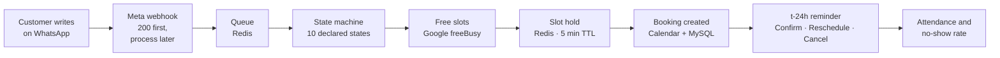

<h1 align="center">AgendaLlena</h1>

<p align="center">
  <strong>WhatsApp scheduling for Latin American small businesses with 3 to 20 employees.</strong><br>
  The customer writes, the bot replies in seconds, offers slots that are <em>actually free</em> in the<br>
  business's Google Calendar, books the appointment and confirms it 24 hours ahead.
</p>

<p align="center">
  
  
  
  
  
  
  
</p>

---

## The problem

A Latin American small business with three to twenty employees loses money through two holes nobody measures:

| Hole | How much it hurts | How it's handled today |
| :-- | :-- | :-- |
| **It takes hours to answer a WhatsApp message** | Someone asking for an appointment who gets no reply within minutes moves on to the next business | Someone answers when they can, between customers |
| **20% to 35% of appointments are no-shows** | An empty chair that was already paid for | Nothing. Nobody calls to confirm |
| **It rejects CRMs** | They've been asked to switch tools and they won't | WhatsApp and a spreadsheet |

The third row is the one that defines the product: **you can't ask a small-business owner to switch tools.** They keep using the WhatsApp and Google Calendar they already have; AgendaLlena sits in between and does the work.

---

## What it does, end to end



The whole path works and is covered by tests. The reminder was sent to a real phone, **Confirm** was tapped, and the stamp came back intact.

Around it: a Vue panel for the owner (conversations, schedule and message settings, attendance, failed reminders), handoff to a human, bot pause, and a periodic reconciliation that detects when Google and the database have drifted apart.

---

## Why I built it

**Because it's a real software problem disguised as CRUD.** A scheduler looks like a form until you run into cases like these:

- 2 customers picking the same slot seconds apart.
- A third party failing halfway through a distributed transaction that can't be a transaction.
- Several businesses sharing one database, and none of them can ever see the others' data.
- Time zones that change by decree and shift an appointment by an hour **without throwing a single error**.

**Because I wanted a project where you can see my judgment in the code.** Every hard decision has its reasoning written right next to the line that implements it. The decisions I haven't made yet are marked with ⚠️, so nobody mistakes a guess for a decision.

**Because I wanted to put Spec-Driven Development into practice.** This is where I applied what I learned about AI-assisted SDD in the [LIDR AI for Devs master's program](https://www.lidr.co/ia-devs/). I write the spec first and derive the code from it:

```
PRD, architecture and flows → story maps → user stories → tickets with acceptance criteria → tests → implementation
```

AI agents work inside that chain, each one locked to its own step. Every step traces back to the previous one by ID.

**Because I plan to sell it.** There's a lean canvas, a PRD, a story map, 50 estimated tickets and a pilot plan. The goal is to bill for it.
